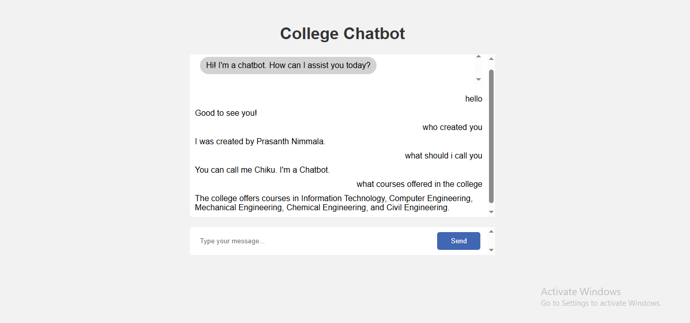

# College Chatbot Using ML Algorithm and NLP Toolkit

The College Chatbot is a Python-based chatbot that utilizes machine learning algorithms and natural language processing (NLP) techniques to provide automated assistance to users with college-related inquiries. The chatbot aims to improve the user experience by delivering quick and accurate responses to their questions.

## Methodology

The chatbot is developed using a combination of natural language processing techniques and machine learning algorithms. The methodology involves data preparation, model training, and chatbot response generation. The data is preprocessed to remove noise and increase training examples using synonym replacement. Multiple classification models are trained and evaluated to find the best-performing one. The trained model is then used to predict the intent of user input, and a random response is selected from the corresponding intent's responses. The chatbot is devoloped as a web application using Flask, allowing users to interact with it in real-time but yet to be deployed.



## Motivation

The motivation behind this project was to create a simple chatbot using my newly acquired knowledge of Natural Language Processing (NLP) and Python programming. As one of my first projects in this field, I wanted to put my skills to the test and see what I could create.

[I followed a guide referenced in the project](https://thecleverprogrammer.com/2023/03/27/end-to-end-chatbot-using-python/) to learn the steps involved in creating an end-to-end chatbot. This included collecting data, choosing programming languages and NLP tools, training the chatbot, and testing and refining it before making it available to users.

Although this chatbot may not have exceptional cognitive skills or be state-of-the-art, it was a great way for me to apply my skills and learn more about NLP and chatbot development. I hope this project inspires others to try their hand at creating their own chatbots and further explore the world of NLP.

### Or

You can run Chatbot Through Terminal

```
git clone https://github.com/PrasanthNimmala0/college_chatbot

cd College_chatbot

pip install -r requirements.txt

python app.py
```

<div align="center">
<h3> Connect with me<a href="https://gifyu.com/image/Zy2f"></a>
</h3> 
<p align="center">
    <a href="mailto:nimmalaprasanthtirupatireddy@gmail.com" target="_blank"></a> 
    <a href="https://www.linkedin.com/in/prasanth-tirupati-reddy-nimmala-631061370" target="_blank"></a>
    <a href="https://www.instagram.com/prasanth_reddy_444?igsh=MTR6aDBiYngyOXplZw==" target="_blank"></a>
    <a href="https://github.com/PrasanthNimmala0" target="_blank"></a>
</p>
